```mermaid
graph LR
%% -- NODES & SUBGRAPHS --
subgraph "Ingestion Layer"
P[Python Producer] -->|Generates Avro| K[Kafka Topic: users]
end

    subgraph "Processing Layer"
        K -->|Read Avro| C[Kafka Connect]
        %% Custom SMT with bullet points
        C -- Apply SMT --> SMT["<b>Custom SMT</b><br/>• Filter Data<br/>• Derive Columns"]
        SMT -.-> C
    end

    subgraph "Storage Layer"
        C -->|Write JSON| M[MinIO S3 Bucket]
    end

    subgraph "Verification Layer"
        V[Streamlit Dashboard]
        %% Verification links
        V -.->|Read Source| K
        V -.->|Read Sink| M
    end
    
    %% -- STYLING --
    %% Added 'color:black' to the styles below
    style P fill:#f9f,stroke:#333,stroke-width:2px,color:black
    style C fill:#bbf,stroke:#333,stroke-width:2px,color:black
    style M fill:#bfb,stroke:#333,stroke-width:2px,color:black
    
    %% Style for the SMT box (Dashed white box with black text)
    style SMT fill:#fff,stroke:#333,stroke-dasharray: 5 5,color:black,text-align:left
```

# 🚀 Kafka to MinIO(S3) Data Pipeline using Kafka Connect with Custom SMT

An end-to-end streaming data pipeline that ingests user profile avro data into **Apache Kafka**, applies a **Custom Single Message Transform (SMT)** to redact sensitive information (PII) and derive new columns. Finally, sinks the cleaned + enriched data into **MinIO (S3)** in JSON format.

Includes a Streamlit GUI to visually compare source and sink data and verify the transformation logic.

Key goals of this project is to demonstrate that by empowering Kafka connect with SMT, we can take following actions on in-flight data:
1. Filter
2. Drop columns
3. Mask a PII data
4. Add new columns

## 🏗 Architecture

## ✨ Features

* **Schema Enforcement:** Uses **Confluent Schema Registry** to enforce Avro schemas at the source.
* **Custom Java Plugin:** A custom-built Kafka Connect SMT (`UserProfileTransform`) that automatically removes sensitive fields (`raw_password_hash`) before storage.
* **S3 Sink Connector:** Configured to convert binary Avro data into human-readable **JSON** objects in MinIO.
* **Audit Tool:** A custom **Streamlit** app that connects to both Kafka (Source) and MinIO (Sink) to verify data completeness and transformation rules side-by-side.

## 🛠️ Prerequisites

* Docker & Docker Compose
* **Python 3.10.11** (Tested)
* **Java 11 (Amazon Corretto)** - Required to compile the SMT JAR file (`mvn package`).

## 🚀 Quick Start

### 1. Build SMT JAR

Compile the Java Single Message Transform so Kafka Connect can load it. You will need mvn.

```bash
cd smt
mvn clean package
cd ..

```

### 2. Install Python Dependencies: This step is required to setup the producer script which dumps test avro data to Kafka.

```bash
cd producer
# Create virtual env
python -m venv .venv

# Activate (Mac/Linux)
source .venv/bin/activate

# Activate (Windows)
# .venv\Scripts\activate

pip install -r requirements.txt

```

### 3. Start Infrastructure

Launch Kafka, Zookeeper, Schema Registry, MinIO(S3), and Redpanda Console.

```bash
# cd to the project root folder
docker-compose up -d
```

### 4. Make sure services are up and running in Redpanda console
```
Go to http://localhost:8080
1. In the Overview tab, in the cluster details section, you should see Kafka Connect and Schema Registry.
```

### 5. Create s3 bucket
```
Go to http://localhost:9001.
Login with minioadmin/minioadmin as username/password.
Create a bucket named `user-profiles-dump`
```

### 6. Deploy Connector

Configure the S3 Sink Connector with the JSON format and Custom SMT settings.

```bash
# Run following command to make sure connect service is running and is ready to receive request.
docker logs connect

# Run following command to register the connector defined in s3-sink.json
curl -X POST http://localhost:8083/connectors \
  -H "Content-Type: application/json" \
  -d @connectors/s3-sink.json

# In the Redpanda console, go to Connect/ Kafka Connect tab, you should see the connector we just registered.
```

### 6. Produce Data

Generate synthetic user data and send to Kafka.

```bash
python producer.py

```

### 7. Verify Pipeline

Launch the verification UI to prove that data is picked from Kafka by Connect, in flight transformations were done on them and then dumped to MinIO(S3).

```bash
streamlit run verifier_ui.py

```

## 📂 Project Structure

```text
.
├── connectors/           # Kafka Connect JSON configurations
│   └── s3-sink.json      # S3 Sink config with SMT settings
├── smt/                  # Java source for Custom SMT
│   ├── src/
│   └── pom.xml           # Maven build configuration
├── producer.py           # Python script to generate Avro data
├── verifier_ui.py        # Streamlit dashboard for auditing
├── docker-compose.yml    # Infrastructure definition
└── requirements.txt      # Python dependencies

```

## 🔍 Verification Logic

The verification tool checks three specific conditions for every record:

1. **Completeness:** Did the user ID from Kafka appear in MinIO?
2. **Filtering:** Was the record intentionally dropped (e.g., empty name)?
3. **Transformation:** Is the `raw_password_hash` field **missing** from the MinIO record (as expected)?
4. **Mask PII data:** email column value is redacted.

## Additional tips

1. To shut down everything along with deleting mounted data, run `docker-compose down -v`
2. For the connect to work, s3 bucket should be pre-created. If you accidentally registered the connector before creating the S3 bucket and you see the connect task is in failed state in Redpanda console, you can run following curl command to restart it.
   
    a. Get the connector name ` curl http://localhost:8083/connectors`. It should give you `s3-sink-users`.
   
    b. `curl -X POST "http://localhost:8083/connectors/s3-sink-users/restart?includeTasks=true&onlyFailed=true"`
    
    c. Visit Redpanda console -> Connect -> Kafka connect, you should see connect back in running state.

    d. Go to MinIO(S3), you should see data dumped by Connect which it picked up from Kafka.