```mermaid
graph LR
%% -- NODES & SUBGRAPHS --
subgraph "Ingestion Layer"
P[Python Producer] -->|Generates Avro| K[Kafka Topic: users]
end

    subgraph "Processing Layer"
        K -->|Read Avro| C[Kafka Connect]
        %% Custom SMT with bullet points
        C -- Apply SMT --> SMT["<b>Custom SMT</b><br/>• Filter Data<br/>• Derive Columns"]
        SMT -.-> C
    end

    subgraph "Storage Layer"
        C -->|Write JSON| M[MinIO S3 Bucket]
    end

    subgraph "Verification Layer"
        V[Streamlit Dashboard]
        %% Verification links
        V -.->|Read Source| K
        V -.->|Read Sink| M
    end
    
    %% -- STYLING --
    %% Added 'color:black' to the styles below
    style P fill:#f9f,stroke:#333,stroke-width:2px,color:black
    style C fill:#bbf,stroke:#333,stroke-width:2px,color:black
    style M fill:#bfb,stroke:#333,stroke-width:2px,color:black
    
    %% Style for the SMT box (Dashed white box with black text)
    style SMT fill:#fff,stroke:#333,stroke-dasharray: 5 5,color:black,text-align:left
```

# 🚀 Kafka to MinIO(S3) Data Pipeline using Kafka Connect with Custom SMT

A resilient, end-to-end streaming data pipeline that ingests user profile avro data into **Apache Kafka**, applies a **Custom Single Message Transform (SMT)** to redact sensitive information (PII) and derive new columns. Finally, sinks the cleaned + enriched data into **MinIO (S3)** in JSON format.

Includes a Streamlit GUI to visually compare source and sink data and verify the transformation logic.

## 🏗 Architecture

## ✨ Features

* **Schema Enforcement:** Uses **Confluent Schema Registry** to enforce Avro schemas at the source.
* **Custom Java Plugin:** A custom-built Kafka Connect SMT (`UserProfileTransform`) that automatically removes sensitive fields (`raw_password_hash`) before storage.
* **S3 Sink Connector:** Configured to convert binary Avro data into human-readable **JSON** objects in MinIO.
* **Audit Tool:** A custom **Streamlit** app that connects to both Kafka (Source) and MinIO (Sink) to verify data completeness and transformation rules side-by-side.

## 🛠️ Prerequisites

* Docker & Docker Compose
* Python 3.9+
* Java 11+ (Only if modifying the Java SMT code)

## 🚀 Quick Start

### 1. Start Infrastructure

Launch Kafka, Zookeeper, Schema Registry, MinIO, and Redpanda Console.

```bash
docker-compose up -d

```

### 2. Install Python Dependencies

```bash
pip install -r requirements.txt

```

### 3. Deploy Connector

Configure the S3 Sink Connector with the JSON format and Custom SMT settings.

```bash
curl -X POST http://localhost:8083/connectors \
  -H "Content-Type: application/json" \
  -d @connectors/s3-sink.json

```

### 4. Produce Data

Generate synthetic user data (with passwords) and send to Kafka.

```bash
python producer.py

```

### 5. Verify Pipeline

Launch the verification UI to prove that passwords were dropped and all rows arrived.

```bash
streamlit run verifier_ui.py

```

## 📂 Project Structure

```text
.
├── connectors/           # Kafka Connect JSON configurations
│   └── s3-sink.json      # S3 Sink config with SMT settings
├── src/
│   └── main/java/        # Java source for Custom SMT
├── producer.py           # Python script to generate Avro data
├── verifier_ui.py        # Streamlit dashboard for auditing
├── docker-compose.yml    # Infrastructure definition
└── requirements.txt      # Python dependencies

```

## 🔍 Verification Logic

The verification tool checks three specific conditions for every record:

1. **Completeness:** Did the user ID from Kafka appear in MinIO?
2. **Filtering:** Was the record intentionally dropped (e.g., empty name)?
3. **Transformation:** Is the `raw_password_hash` field **missing** from the MinIO record (as expected)?